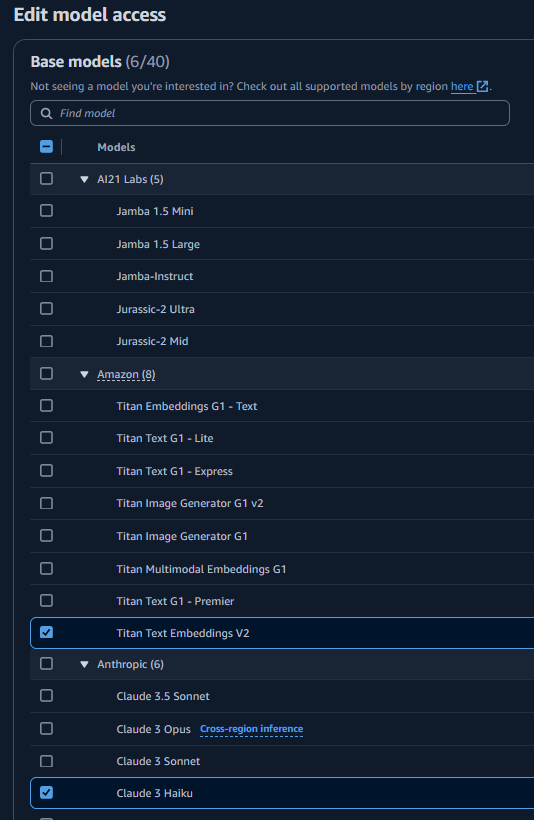
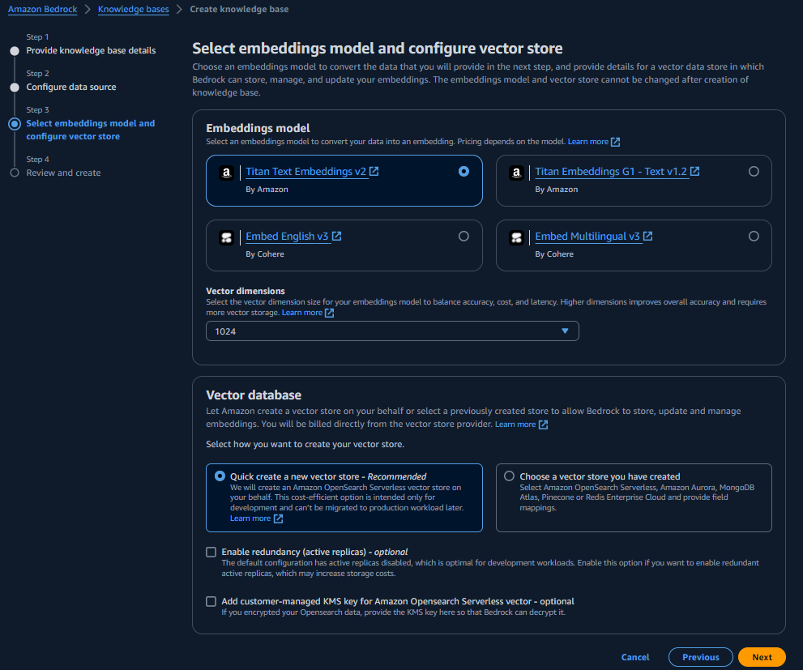
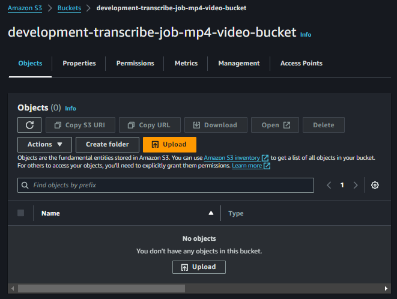
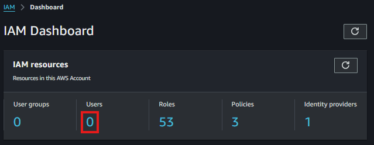
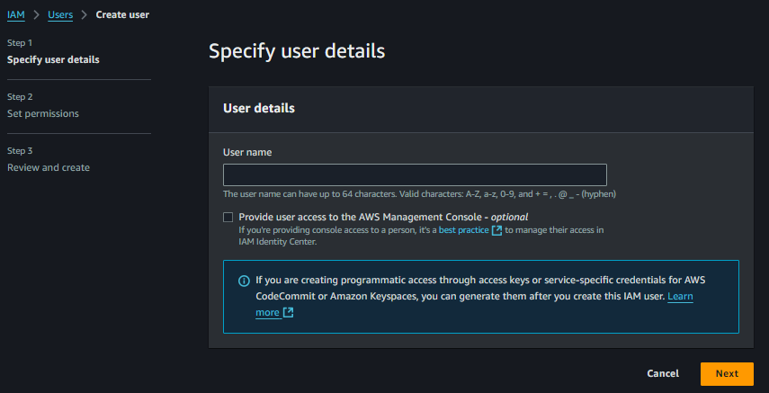

# Projeto de Transcrição de Vídeos e Chatbot IA com AWS Bedrock, Flowise e Terraform

## 1. Introdução

### Visão Geral

Este projeto visa a transcrição de vídeos e a criação de uma base de conhecimento usando a AWS Bedrock Knowledge Base, integrando um chatbot de IA através do Flowise. Além disso, utilizamos o Terraform para o provisionamento da infraestrutura como código, garantindo automação e escalabilidade.

### Objetivos

- Processar e transcrever vídeos automaticamente
- Gerar uma base de conhecimento a partir das transcrições
- Implementar um chatbot IA capaz de interagir com o conteúdo transcrito

### Tecnologias Utilizadas

- **AWS S3**: Armazenamento de vídeos e transcrições
- **AWS Lambda**: Processamento serverless de vídeos
- **AWS Bedrock**: Serviço de IA para modelos de linguagem
- **AWS Transcribe**: Reconhecimento de fala e transcrição
- **AWS Bedrock Knowledge Base**: Indexação e vetorização de dados textuais
- **Python**: Desenvolvimento de funções Lambda
- **Flowise**: Criação de fluxos de trabalho de IA
- **Terraform**: Gerenciamento de infraestrutura como código (IaC)

## 2. Arquitetura do Sistema

### Diagrama do projeto


### Fluxo de dados

1. Upload de vídeos pelo usuário para o S3
2. Acionamento automático da função Lambda
3. Processamento do vídeo e envio para transcrição
4. Recebimento da transcrição do AWS Transcribe
5. Armazenamento da transcrição no S3
6. Envio da transcrição para vetorização no AWS Bedrock
7. Vetorização e armazenamento na AWS Bedrock Knowledge Base
8. Consulta do Flowise à base de conhecimento
9. Geração de respostas utilizando o AWS Bedrock
10. Interação do frontend com o Flowise
11. Uso do chatbot pelo usuário final

## 3. Configuração do Ambiente

##### Pré-requisitos

- Conta AWS
- AWS CLI instalado e configurado
- Terraform instalado
- Node.js e npm (para Flowise)
- Python 3.8+
- Docker

##### Configuração Inicial

1. Clone o repositório:

```
git clone https://github.com/jefersonlopesv4/transcribe-chat-ai.git
cd transcribe-chat-ai
```

2. Configure as credenciais AWS:

```
aws configure
```

3. Instale as dependências do projeto front-end:

```
cd frontend
npm install
```

## 4. Infraestrutura como Código com Terraform

### Estrutura do Código Terraform

```
terraform/
├── sample/
├── terraform_state/
├── deploy.sh
└── destroy.sh
└── modules/
    ├── state/
    ├── main.tf
    ├── outputs.tf
    └── variable.tf
├── stacks/
    ├── move_transcript_to_knowledge_base/
    └── transcript_job_mp4/
```

### Implantação da Infraestrutura

1. Navegue até o diretório do Terraform state:

```
cd terraform/sample/terraform_state
```

2. Inicialize o Terraform:

```
terraform init
```

3. Revise o plano de execução:

```
terraform plan
```

4. Aplique as mudanças:

```
terraform apply
```

5. Navegue até o diretório sample:

```
cd ..
```

6. Rode o Shell Script para realizar o deploy:

```
sh deploy.sh
```

7. Após os testes, rode o Shell Script para destruir:

```
sh destroy.sh
```

### Configuração do AWS Bedrock

1. Acesse o console AWS Bedrock                              
   

2. Navegue até Bedrock Configurations, Model Access e clique em Modify model access ou Enable specific models
   

3. Faça o Request access dos modelos Titan Text Embeddings V2 e Claude 3 Haiku, preencha os dados que forem requeridos                            
   
   

4. Realize o submit

### Configuração Base de Conhecimento Bedrock

1. Acesse o console AWS Bedrock                                      
   
2. Navegue até o Knowledge bases e clique em Create knowledge base

3. Preencha os detalhes da base de conhecimento

4. Preencha os dados de Data Source, selecione o bucket da base de conhecimento
   
5. Selecione o Embedding model, no caso o Titan Text Embeddings v2 e depois em next
   
6. Faça o submit e pronto, a base de conhecimento foi criada
7. Acesse o console AWS S3  

8. Acesse o bucket development-transcribe-job-mp4-video-bucket

9. Clique em upload     

10. Envie os arquivos de video que você usará, clique em upload e os lambdas automaticamente irão realizar a transcrição do video e salvar no bucket da base de conhecimento do bedrock

11. Acesse novamente o console AWS Bedrock
12. Navegue até Knowledge bases e selecione a base de conhecimento criada

13. Selecione o Data Source e clique em Sync


### Configuração do Flowise

#### Criação de IAM
1. Acesse o console AWS IAM     

2. Clique na área marcada           

3. Clique em Create user    

4. Preencha os detalhes do usuário e clique em next

5. Selecione a opção Attach policies directly e selecione a police "AdministratorAccess" e clique em next  
*Obs: Utilize essa police somente em ambiente de testes*

6. Realize a criação do usuario

7. Após criar o usuario, clique nele e depois clique em "Create access key"

8. Preencha da seguinte forma e clique em next

9. Preencha os dados restantes e clique em Create access key

10. Faça o download do CSV através de "Download .csv file" ou anote os dados de Access key e Secret access key


#### Configuração do Chatflow
1. Navegue até o diretorio do Flowise               
```
cd flowise
```
3. Rode o docker compose para subir o ambiente do flowise
```
docker compose up
```
4. Acesse a url
```
http://localhost:3030/
```
5. Navegue até Credentials e clique em Add Credential

6. No nosso caso, selecione AWS security credentials

7. Preencha os dados com o Access Key e Secret Access Key que geramos

8. Navegue até Chatflows e clique em Add New

9. No icone arredondado de "+" pesquise por todos os componentes que adicionamos (AWS ChatBedrock, AWS Bedrock Knowledge Base Retriever, Buffer Memory, Conversational Retrieval QA Chain)

10. Realize a conexão dos componentes com o Conversational Retrieval QA Chain

11. Clique no ícone de salvar e salve o Chatflow

12. Após isso, clique no icone "</>" e anote o valor de chatflowid

13. Navegue até o arquivo chamado page.tsx na pasta frontend\src\app e modifique o chatflowid para o que foi anotado e salve

14. Rode o seguinte comando para iniciar o frontend
```
npm run dev
```
15. Acesse a url
```
http://localhost:3000/
```
16. Pronto, você consegue realizar perguntas para o chat


# aws-transcript-and-bedrock-knowledge-base
